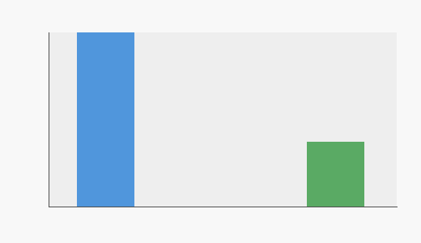
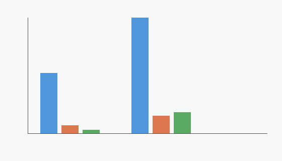
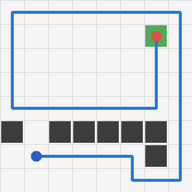
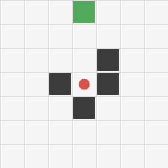
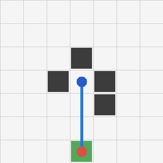
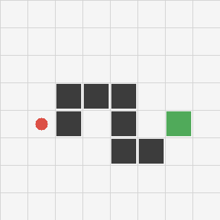

# 基于行为克隆的二维移动机器人导航实验与关键状态诊断

在二维栅格环境中，由启发式教师策略生成示范数据，训练行为克隆模型，并通过统一 benchmark 验证关键转弯样本补强对策略表现的影响。

## 项目背景与问题

这个项目的目标是搭建一个最小移动机器人模仿学习闭环，而不是构建真实机器人系统、VLA、强化学习平台或复杂仿真器。

核心问题是：离线动作预测正确，不等于连续导航成功。移动机器人每一步动作都会改变后续状态，尤其是在 `front_blocked`、必须左转、必须右转这类关键状态中，一次错误动作可能导致碰撞、卡死，甚至整条轨迹失败。

因此，本项目不只看 offline accuracy，还通过 rollout、碰撞统计、失败 case 和轨迹图检查行为克隆策略是否真的能在环境中连续运行。

## 技术流程

```text
环境构建
-> 教师策略
-> 示范数据生成
-> 行为克隆训练
-> rollout 评估
-> 失败诊断
-> turn-focused 数据补强
-> v0.7 统一对比评估
```

主要阶段：

- `v0.1`: 最小二维栅格机器人闭环，包含 observation、action、reward、CSV log 和 trajectory PNG。
- `v0.2`: 批量实验系统，支持多个 case 和 summary。
- `v0.3`: 加入动作失败、观测噪声、碰撞统计。
- `v0.4`: 对比 baseline policy 和 obstacle-aware teacher policy。
- `v0.5`: 由启发式教师策略生成 demonstration dataset。
- `v0.6`: 训练最小 KNN behavior cloning baseline。
- `v0.6.5`: 增加 turn-focused cases，补强关键转弯样本覆盖。
- `v0.6.6`: 基于 turn-focused dataset 重新训练行为克隆模型。
- `v0.7`: 固定 benchmark 下统一对比 teacher、原始 BC、改进 BC。

## 项目结构

```text
embody/
  grid_world.py          # 2D grid world、状态、观测、动作、reward、CSV/PNG 输出
  policy.py              # 启发式教师策略与规则策略
  dataset.py             # demonstration dataset 生成
  behavior_cloning.py    # KNN behavior cloning、离线评估、rollout 评估

scripts/
  run_v07_final_comparison.py              # 最终统一对比入口
  train_v066_turn_focused_behavior_cloning.py
  train_v065_turn_focused_dataset_coverage.py
  train_v06_behavior_cloning.py

models/
  v0_6/behavior_cloning_policy.json        # 原始 BC 模型
  v0_6_6/knn_class_balanced.json           # 最终展示用改进 BC 模型

experiments/
  v0_7_final/                              # 最终统一评估结果、表格、轨迹图
```

## 最终统一评估结果

最终结果来自：

- `experiments/v0_7_final/final_comparison_summary.json`
- `experiments/v0_7_final/final_comparison_table.csv`

三种策略在同一套 benchmark cases、同一环境参数、同一 rollout 规则下评估：

| 策略 | 成功数 | 成功率 | 平均步数 | 平均奖励 | 碰撞数 |
|---|---:|---:|---:|---:|---:|
| Teacher: `obstacle_aware_goal` | 8/8 | 100% | 20.12 | 13.14 | 0 |
| Original BC: `v0.6 behavior_cloning_knn` | 0/8 | 0% | 37.50 | -68.66 | 279 |
| Improved BC: `v0.6.6 knn_class_balanced` | 3/8 | 37.5% | 29.25 | -45.71 | 207 |

固定 benchmark cases：

- `no_obstacle_8x8`
- `left_turn_required`
- `right_turn_required`
- `front_blocked_left_open`
- `front_blocked_right_open`
- `corridor_left_turn`
- `corridor_right_turn`
- `consecutive_turns`

## 可视化结果

### 成功率对比



### 数据动作分布对比



### 代表性轨迹

教师策略成功案例：



原始 BC 失败案例：



Improved BC 成功案例：



Improved BC 仍失败或碰撞明显的案例：



## 关键发现

- 在统一测试下，turn-focused 数据补强让 behavior cloning 从 `0/8` 提升到 `3/8`。
- 改进模型的平均奖励从 `-68.66` 提升到 `-45.71`，碰撞数从 `279` 降到 `207`。
- 改进后的模型已经不再是纯 always-forward collapse，但仍不是可靠导航策略。
- `3/8` 的成功率和 `207` 次碰撞说明：简单 KNN behavior cloning 可以验证模仿学习管线，但不足以解决稳定导航。
- 项目价值不在于“做出了最强模型”，而在于建立了完整、可复现、可诊断的实验闭环，并暴露了简单行为克隆在关键状态上的局限。

## 如何运行

推荐先运行测试，再运行最终统一评估：

```powershell
python -m unittest discover -s tests
python scripts\run_v07_final_comparison.py
```

运行后会生成：

```text
experiments/v0_7_final/
  benchmark_cases.json
  final_comparison_summary.json
  final_comparison_table.csv
  case_level_results.csv
  final_success_rate_comparison.png
  dataset_action_distribution_comparison.png
  trajectories/
```

## 当前不能夸大的地方

- 这不是强化学习项目。
- 这不是 VLA 或大模型机器人控制项目。
- 这不是真实机器人部署。
- `obstacle_aware_goal` 是启发式教师策略，不是最优专家。
- `v0.6.6 knn_class_balanced` 只是一个最小行为克隆 baseline，统一 benchmark 下仍只成功 `3/8`。
- 当前结果更适合描述为：完成了从环境、数据、训练、评估到错误诊断的最小模仿学习闭环。
